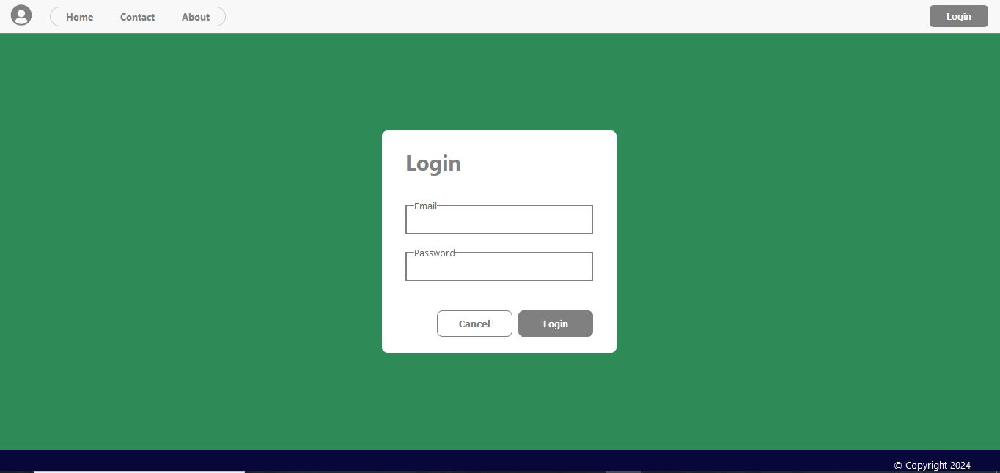
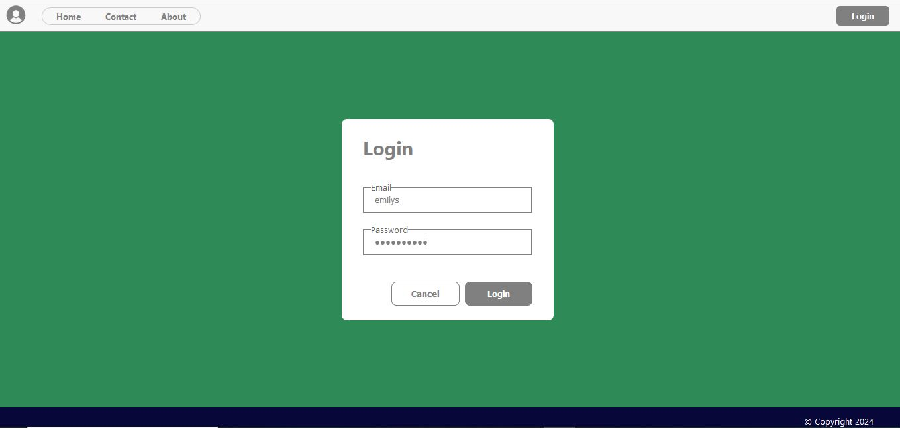
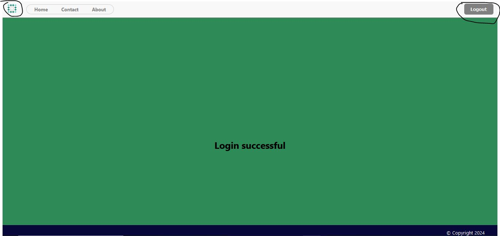
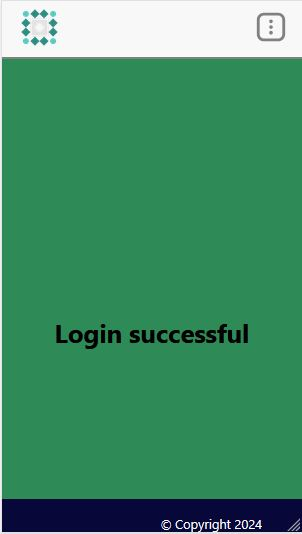
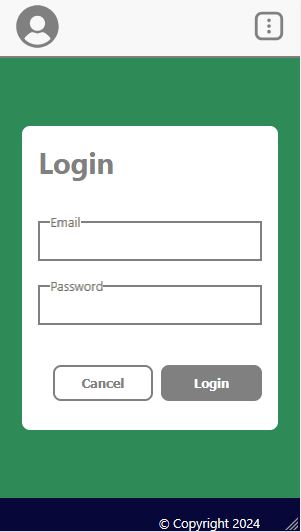

# Getting Started with Quantory test task

In the project directory, you can run:

### `npm start`

Runs the app in the development mode.\
Open [http://localhost:3000](http://localhost:3000) to view it in the browser.

The page will reload if you make edits.\
You will also see any lint errors in the console.

By opening the following link http://localhost:3000 the web page should be opened.

  

The navigation bar buttons doesnt navigate you to another pages due to there werent requirements (descriptions) about it but there is hover and design as in the task.

  

The requirements were to provide integration with dummy service. Authentification is possible by using username and password because it was provided in dummy service, but by the template of the task first input was labeled as email. Therefore its labeled as email.

  

Lets login as emilys. JSON of users containted each user image and decided to use it instead of logo. Also you can see that login button has change to logout button by clicking which you can logout. After refreshing the page token doesnt dissapear and stays. The time of token to expire is 30 minutes.

  

As one of the requirements application should be resposible.

  

  

